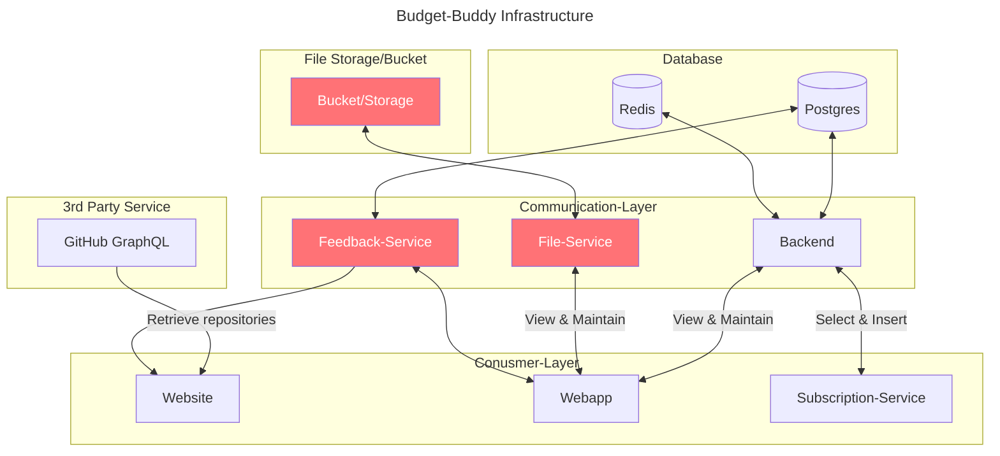

# Setup

## TODO

1. Infrastruktur planen
   1. Infrastruktur
   2. Datenbank
      1. ~~Tabellen erstellen~~
      2. Views
      3. Checks hinzufügen
2. Backend
   1. Objekte abbilden
      1. Klassen im Diagramm abbilden
   2. Daten abrufen
   3. Daten erstellen
   4. Daten löschen
   5. Daten updaten
   6. Logging
3. DB Migration
   1. Programm schreiben um Datenbanken in das neue Schema umzuwandeln und in der neuen Datenbank zu speichern
4. Subscription-Service umbauen

## Infrastructure (WIP)

> Boxes in red are "planned" features and not iomplemented in the current version (therefore not in set-up during deployment)

## Getting started
https://start.spring.io/#!type=gradle-project&language=java&platformVersion=3.1.4&packaging=jar&jvmVersion=17&groupId=de.budget-buddy&artifactId=backend&name=backend&description=Spring%20backend%20for%20providing%20auth%20service%20and%20manage%20data&packageName=de.budget-buddy.backend&dependencies=devtools,web,session,data-rest,security,data-redis,postgresql,lombok
### Local setup

### Docker

## Deployment
