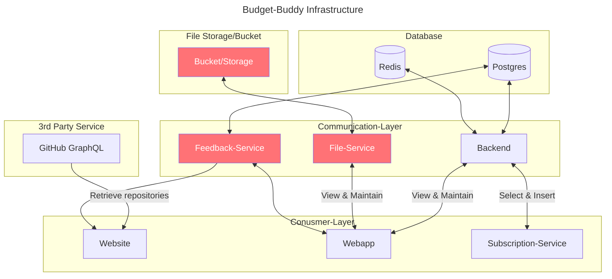

# Setup

## Infrastructure (WIP)

> [!NOTE]
> Boxes in red are "planned" features and not iomplemented in the current version (therefore not in set-up during deployment)

## Database

## Getting started

### Local setup

### Docker

## Deployment
