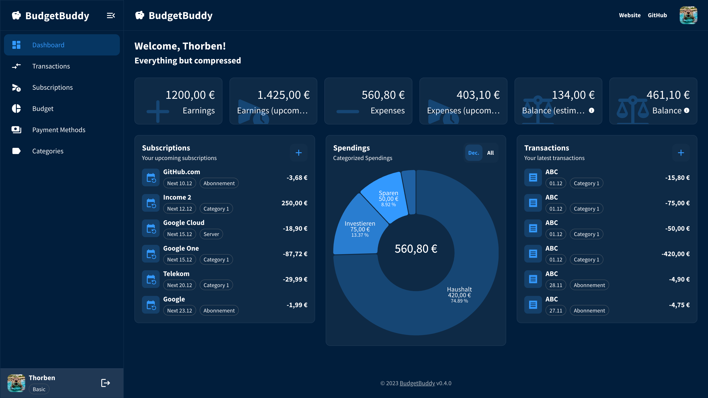
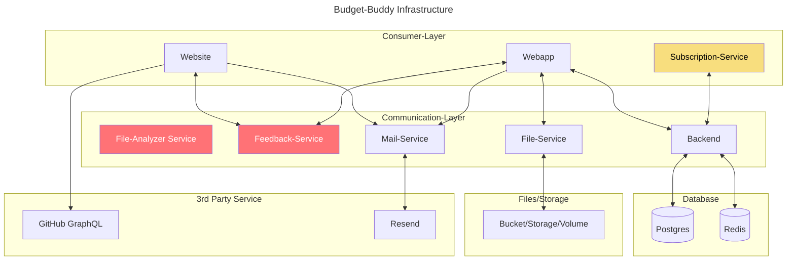

# Setup



## ToC

- [Setup](#setup)
  - [ToC](#toc)
  - [Getting started](#getting-started)
  - [Infrastructure](#infrastructure)
    - [Services](#services)
    - [Overview](#overview)
  - [Deployment](#deployment)
  - [Backups](#backups)
    - [Postgres](#postgres)
    - [Redis](#redis)

## Getting started

> [!IMPORTANT]
> This guide is designed to start the production environment.

1. Clone this repository

   ```bash
   git clone git@github.com:BudgetBuddyDE/setup.git
   ```

2. Set all the required environment variables as defined in the `.env.example` and save it under `production/.env`
3. Start the docker containers

   3.1. Log into the Github Image Registry

   ```bash
   echo <GH_PAT> | docker login ghcr.io -u <GH_USER> --password-stdin
   ```

   Now you should be able to pull images public from the Github Image Registry

   3.2. Start your containers

   ```bash
   docker compose up -d
   # or just some specific services
   docker compose up -d <services...>
   ```

> [!WARNING]
> You have currently only started the services for Budget-Buddy. The web application still needs to be started separately. For that, go to the Webapp repository.

## Infrastructure

### Services

<table>
  <thead>
    <tr>
      <th>Environment</th>
      <th>Service</th>
      <th>Exposed</th>
      <th>Internal</th>
    </tr>
  </thead>
  <tbody>
    <!-- Production -->
    <tr>
      <td rowspan="3">
        <strong>Production</strong>
      </td>
      <td>Backend</td>
      <td>
        <code>8080</code>
      </td>
      <td>
        <code>8080</code>
      </td>
    </tr>
    <tr>
      <td>Mail-Service</td>
      <td>
        <code>8070</code>
      </td>
      <td>
        <code>8090</code>
      </td>
    </tr>
    <tr>
      <td>File-Service</td>
      <td>
        <code>8090</code>
      </td>
      <td>
        <code>8180</code>
      </td>
    </tr>
    <!-- DEVELOPMENT -->
    <tr>
      <td rowspan="4">
        <strong>Development</strong>
      </td>
      <td>Backend</td>
      <td>
        <code>8081</code>
      </td>
      <td>
        <code>8080</code>
      </td>
    </tr>
    <tr>
      <td>Mail-Service</td>
      <td>
        <code>8071</code>
      </td>
      <td>
        <code>8090</code>
      </td>
    </tr>
    <tr>
      <td>File-Service</td>
      <td>
        <code>8091</code>
      </td>
      <td>
        <code>8180</code>
      </td>
    </tr>
  </tbody>
</table>

### Overview

> [!NOTE]
> Boxes in red are "planned" features and not iomplemented in the current version (therefore not in set-up during deployment)
>
> Boxes in yellow are deprecated and not used anymore



## Deployment

> [!IMPORTANT]
> Make sure to grant access permission to the `rebuild_database.sh` with `sudo chown user:group rebuild_database.sh` and make the script executeable with `chmod +x rebuild_database.sh`

## Backups

### Postgres

**How to restore backed up data?**

```bash
psql -U <DB_USER> <DB_NAME> < backup.sql
```

### Redis

**How to restore backed up data?**

```bash
redis-cli -h <HOST> -p <PORT> (-a <PASSWORD>) --pipe < dump.rdb
```
