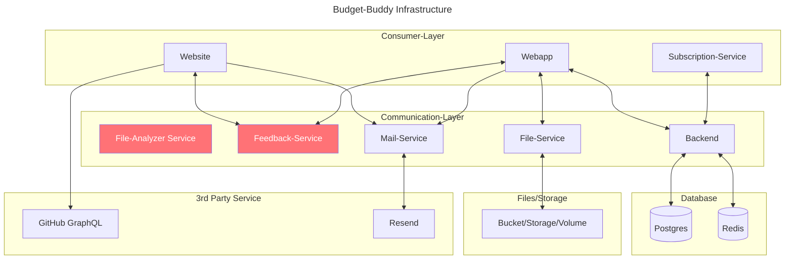

# Setup

## ToC

- [Setup](#setup)
  - [ToC](#toc)
  - [Infrastructure](#infrastructure)
    - [Services](#services)
    - [Database](#database)
  - [Getting started](#getting-started)
    - [Docker-Compose](#docker-compose)
  - [Deployment](#deployment)
  - [Backups](#backups)
    - [Postgres](#postgres)
    - [Redis](#redis)

## Infrastructure

### Services

> [!NOTE]
> Boxes in red are "planned" features and not iomplemented in the current version (therefore not in set-up during deployment)



### Database


## Getting started

1. Log into the Github Image Registry

   ```bash
   echo <GH_PAT> | docker login ghcr.io -u <GH_USER> --password-stdin
   ```

Now you should be able to pull Docker images from Github

### Docker-Compose

```
docker-compose up -d
# or just the essential services
docker-compose up -d postgres redis backend subscription-service
```

## Deployment

> [!IMPORTANT]
> Make sure to grant access permission to the `restart_service.sh` with `sudo chown user:group restart_service.sh` and make the script executeable with `chmod +x restart_service.sh`

## Backups

### Postgres

**How to restore backed up data?**

```bash
psql -U <DB_USER> <DB_NAME> < backup.sql
```

### Redis

**How to restore backed up data?**

```bash

```
